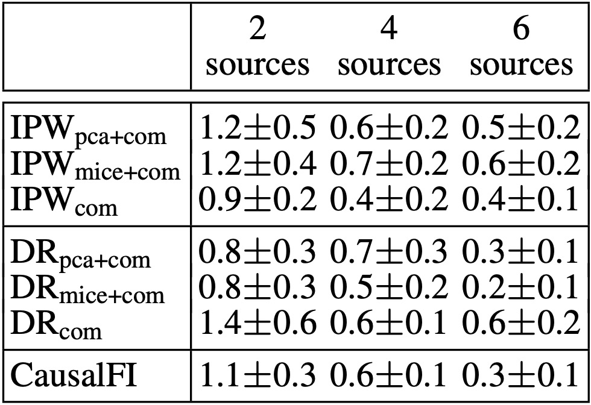
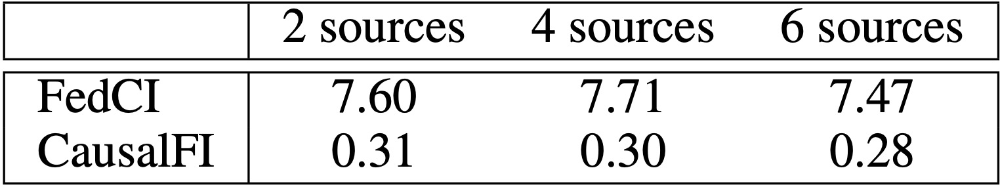

## Federated Learning of Causal Effects from Incomplete Observational Data

### Table of Contents
- [Requirements](#requirements)
- [Import packages](#import-packages)
- [Using GPU or CPU](#using-gpu-or-cpu)
- [Load data](#load-data)
- [Convert numpy arrays to tensors](#convert-numpy-arrays-to-tensors)
- [Configuration](#configuration)
- [Train the model](#train-the-model)
- [Evaluate CATE and ATE](#evaluate-cate-and-ate)
- [Some examples](#some-examples)
- [Some experimental results](#some-experimental-results)


### Requirements
We implemented CausalFI on ```PyTorch``` and used package ```torchbnn``` for Bayesian models. The code has been tested on:
```
pytorch==2.0.1+cu118
torchbnn==1.2
```

### Import packages
Loading required packages for training the models:
```python
import numpy as np
import torch
import torch.nn as nn
import scipy
import random
from scipy.stats import sem
import torchbnn as bnn
from torchbnn.utils import freeze, unfreeze
from model import *
from datasets import IHDP
from evaluation import *
```

### Using GPU or CPU
The following code would check whether GPU is available. If GPU is found, then we use it by default. Otherwise, we would use CPU. 
```python
if torch.cuda.is_available():
  torch.set_default_tensor_type('torch.cuda.FloatTensor')
  print('Use ***GPU***')
  print(torch.cuda.get_device_properties(0).total_memory/1024/1024/1024,'GB')
else:
  print('Use CPU')
device = torch.device("cuda:0" if torch.cuda.is_available() else "cpu")
```

### Load data
There are 2 datasets included in our sample codes: ```SynData50Sources``` and ```IHDP```. The following code would load the ```SynData50Sources``` dataset:
```python
from datasets import SynData50Sources
dataset = SynData50Sources()
source_size = dataset.source_size
train_size = dataset.train_size
test_size = dataset.test_size
val_size = dataset.val_size
```

To load a new dataset, one can create a new class for that dataset in ```datasets.py```. The class should be similar to that of ```SynData50Sources```.

### Convert numpy arrays to tensors
* Let ```Ytr, Ytr_cf, Xtr, Wtr``` be ```numpy``` arrays of the training data.
* Let ```Yte, Yte_cf, Xte, Wte``` be ```numpy``` arrays of the testing data.

First we need to transform these numpy arrays into tensors:
```python
# Tensors of training data
xtr = torch.from_numpy(Xtr).float().to(device)
ytr = torch.from_numpy(Ytr.reshape(-1,1)).float().to(device)
wtr = torch.from_numpy(Wtr.reshape(-1,1)).float().to(device)

# Tensors of testing data
xte = torch.from_numpy(Xte).float().to(device)
yte = torch.from_numpy(Yte.reshape(-1,1)).float().to(device)
wte = torch.from_numpy(Wte.reshape(-1,1)).float().to(device)
```

### Configuration
Configuring settings for model training:
```python
training_iter_z = 10000 # number of iterations
training_iter_zhat = 10000 # number of iterations
training_iter_y = 10000 # number of iterations
learning_rate = 1e-3
display_per_iters=100
hidden_size = 10 # Number of nodes in the hidden layers
output_dir = 'save_outputs' # output directory
```

### Train the model

Train the models in federated setting:

```python
print('*** Learning P(Z|X,Y,W)')
model_server_z, model_sources_z = trainZ_FedGrads(train_x=xtr[:,4:],
                                                  train_w=wtr.reshape(-1),
                                                  train_y=ytr.reshape(-1),
                                                  train_z=xtr[:,:4],
                                                  n_sources=m,
                                                  source_ranges=source_ranges_train,
                                                  hidden_size=hidden_size,
                                                  training_iter=training_iter_z,
                                                  learning_rate=learning_rate,
                                                  display_per_iters=display_per_iters)

print('*** Learning P(Y|X,Z,W) and P(Zr~|X,Zr)')
model_server_zhaty, model_sources_zhaty = trainY_FedGrads(train_x=xtr[:,10:],
                                                          train_w=wtr.reshape(-1),
                                                          train_y=ytr.reshape(-1),
                                                          model_z=model_sources_z,
                                                          dim_z=xtr[:,:10].shape[1],
                                                          n_sources=m,
                                                          source_ranges=source_ranges_train,
                                                          hidden_size=hidden_size,
                                                          training_iter=training_iter_y,
                                                          learning_rate=learning_rate,
                                                          display_per_iters=display_per_iters)

model_server_zhat = model_server_zhaty.model_zhat
model_sources_zhat = [model.model_zhat for model in model_sources_zhaty]
model_server_y = model_server_zhaty.model_y
model_sources_y = [model.model_y for model in model_sources_zhaty]
```

### Evaluate CATE and ATE

The following code would save the errors of ATE and CATE on testing data to folder `output_dir = 'save_outputs'`.

```python
y0pred, y1pred = pred_y0y1(model_server_zhat=model_server_zhat,
                            model_server_y=model_server_y,
                            test_x=xte[:,10:], test_z=xte[:,:10],
                            test_w=wte, test_y=yte, n_sources=m,
                            source_ranges_test=source_ranges_test,
                            idx_sources_to_test=list(range(M)))

eval = Evaluation(mute[:,0], mute[:,1])
y0pred = y0pred.detach().cpu().numpy()
y1pred = y1pred.detach().cpu().numpy()
test_stats.append((eval.absolute_err_ate(y0pred,y1pred), eval.pehe(y0pred, y1pred)))

np.savez('{}/synthetic_test_stats_m{}_replicate{}.npz'.format(output_dir, m,i+1),
          test_stats=np.asarray(test_stats))
```
Next, we print the mean and standard error of the evaluation errors:

```python
import numpy as np
import scipy
# Print results for m = 10 sources, averaging over 10 replicates
m=10 
test_stats = np.concatenate([np.load('save_outputs/test_stats_m{}_replicate{}.npz'.format(m,i))['test_stats']
                      for i in range(1,10+1)],axis=0)
print(np.mean(test_stats,axis=0))
print(scipy.stats.sem(test_stats,axis=0))
```

### Some examples

Please refer to these notebooks and scripts as starting point:
* Train on replicate \#1 of synthetic data: `example_synthetic_replicate1.ipynb`
* Train on replicate \#1 of IHDP data: `example_ihdp_replicate1.ipynb`
* Train on 10 replicates of synthetic data (10 sources): `run_code_synthetic_m10.sh`
* Train on 10 replicates of IHDP data (10 sources): `run_code_ihdp_m10.sh`


## Some experimental results

_**Synthetic datasets**_


Federated inference analysis on synthetic data:


The errors on different percentage of missing features:


Marginal distribution of $Z_1,Z_2,Z_3,Z_4$ pseudo data compared with those of complete and incomplete data:


***

Out-of-sample errors of CATE and ATE on synthetic data (lower is better). Top-3 performances are highlighted in bold. Settings that violate privacy constraint are highlighted in gray and they are only used for comparison purpose.


***

In-sample errors of ATE ($\epsilon_{\text{ATE}}$) on synthetic data:


***

Distribution of the estimated ATE on IHDP data in replicate \#1:


Standard deviation of CausalFI vs. FedCI on synthetic data:


***

_**IHDP dataset**_

Out-of-sample errors of CATE and ATE on IHDP data (lower is better). Top-3 performances are highlighted in bold. Settings that violate privacy constraint are highlighted in gray and they are only used for comparison purpose.


***
In-sample errors of ATE ($\epsilon_{\text{ATE}}$) on IHDP data:



***

Distribution of the estimated ATE on IHDP data in replicate \#1:


Standard deviation of CausalFI vs. FedCI on IHDP data:


